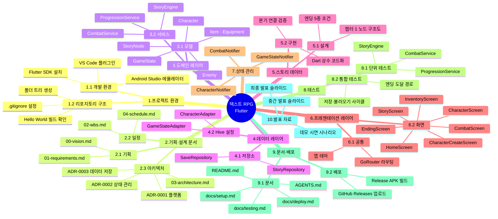

# 02-wbs.md — Work Breakdown Structure

## WBS 차트

---

## 상세 항목 (3단계)

> 산출물 명사형 표현, 각 항목 1~3일 단위

### 1. 프로젝트 환경

#### 1.1 개발 환경
- 1.1.1 Flutter SDK 설치 및 경로 설정
- 1.1.2 Android Studio / 에뮬레이터 구성
- 1.1.3 VS Code Flutter 플러그인 설정

#### 1.2 리포지토리 구조
- 1.2.1 폴더 트리 (`lib/`, `docs/`, `.planning/`) 생성
- 1.2.2 `.gitignore` 설정 (Flutter 기본 + 빌드 산출물)
- 1.2.3 Flutter Hello World 빌드 확인

---

### 2. 기획·설계 문서

#### 2.1 기획 문서
- 2.1.1 비전·목표 (`00-vision.md`)
- 2.1.2 요구사항 MoSCoW 표 (`01-requirements.md`)

#### 2.2 일정 문서
- 2.2.1 WBS 전체 트리 (`02-wbs.md`)
- 2.2.2 6주 일정표 (`04-schedule.md`)

#### 2.3 아키텍처 문서
- 2.3.1 시스템 레이어 다이어그램 (`03-architecture.md`)
- 2.3.2 ADR-0001 플랫폼 결정
- 2.3.3 ADR-0002 상태 관리 결정
- 2.3.4 ADR-0003 데이터 저장 결정

---

### 3. 도메인 레이어 (게임 로직)

#### 3.1 모델
- 3.1.1 `Character` 모델 (HP·MP·STR·DEF·AGI·LV·XP·클래스)
- 3.1.2 `Item` 모델 (이름·타입·효과·수량)
- 3.1.3 `Equipment` 모델 (슬롯·스탯 보너스)
- 3.1.4 `Enemy` 모델 (이름·스탯·드롭 테이블)
- 3.1.5 `StoryNode` 모델 (텍스트·선택지·조건·효과)
- 3.1.6 `GameState` 모델 (현재 노드·플래그·인벤토리·캐릭터)

#### 3.2 서비스
- 3.2.1 `CombatService` (데미지 공식, 상태이상 적용·해제, 턴 처리)
- 3.2.2 `StoryEngine` (노드 탐색, 조건 평가, 선택지 필터링)
- 3.2.3 `ProgressionService` (XP 계산, 레벨업, 스탯 분배)

---

### 4. 데이터 레이어

#### 4.1 저장소
- 4.1.1 `SaveRepository` (Hive 슬롯 3개 CRUD)
- 4.1.2 `StoryRepository` (Dart 상수 스토리 데이터 로드)

#### 4.2 Hive 설정
- 4.2.1 `CharacterAdapter` 등록
- 4.2.2 `GameStateAdapter` 등록
- 4.2.3 저장/불러오기 통합 테스트

---

### 5. 스토리 데이터

#### 5.1 스토리 설계
- 5.1.1 챕터 1 스토리 노드 설계 (분기 구조도)
- 5.1.2 엔딩 5종 조건 정의

#### 5.2 스토리 구현
- 5.2.1 챕터 1 노드 데이터 코드화 (Dart 상수)
- 5.2.2 조건부 선택지 연결 검증

---

### 6. 프레젠테이션 레이어 (UI)

#### 6.1 공통
- 6.1.1 앱 테마 (색상·폰트)
- 6.1.2 GoRouter 라우팅 설정

#### 6.2 화면
- 6.2.1 `HomeScreen` (타이틀·슬롯 선택·새 게임)
- 6.2.2 `CharacterCreateScreen` (이름 입력·클래스 선택)
- 6.2.3 `StoryScreen` (텍스트 출력·선택지 버튼)
- 6.2.4 `CombatScreen` (HP바·턴 로그·행동 버튼)
- 6.2.5 `InventoryScreen` (아이템 목록·장비 슬롯)
- 6.2.6 `CharacterScreen` (스탯·레벨·장비 현황)
- 6.2.7 `EndingScreen` (엔딩 텍스트·처음으로 버튼)

---

### 7. 상태 관리 (Riverpod)

- 7.1 `CharacterNotifier` (스탯 변동·레벨업)
- 7.2 `GameStateNotifier` (현재 노드·플래그·인벤토리)
- 7.3 `CombatNotifier` (전투 상태·턴 진행)

---

### 8. 테스트

#### 8.1 단위 테스트
- 8.1.1 `CombatService` 데미지 공식 테스트
- 8.1.2 `StoryEngine` 조건 평가 테스트
- 8.1.3 `ProgressionService` 레벨업 계산 테스트

#### 8.2 통합 테스트
- 8.2.1 저장 → 불러오기 사이클 테스트
- 8.2.2 스토리 엔딩 도달 경로 테스트

---

### 9. 문서·배포

#### 9.1 문서
- 9.1.1 `docs/setup.md` (환경 설정 가이드)
- 9.1.2 `docs/deploy.md` (APK 빌드 절차)
- 9.1.3 `docs/testing.md` (테스트 실행 방법)
- 9.1.4 `README.md` 완성
- 9.1.5 `AGENTS.md` 작성

#### 9.2 배포
- 9.2.1 Release APK 빌드 (`flutter build apk --release`)
- 9.2.2 GitHub Releases에 APK 첨부

---

### 10. 발표 자료

- 10.1 중간 발표 슬라이드 (`docs/presentation/interim.md`, Marp, 7분)
- 10.2 최종 발표 슬라이드 (`docs/presentation/final.md`, Marp, 12분)
- 10.3 데모 시연 시나리오 문서
