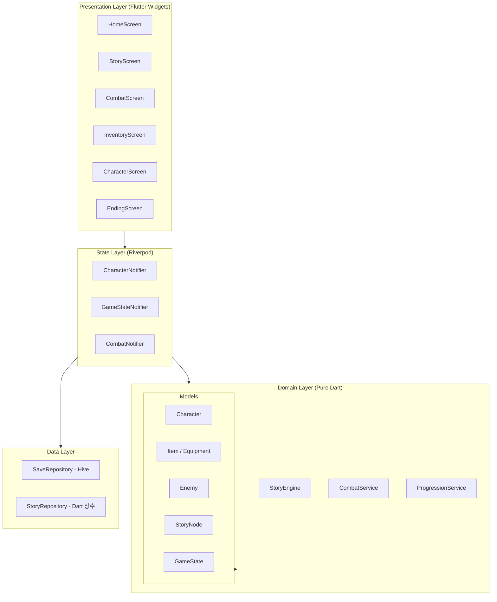

# 03-architecture.md — 시스템 아키텍처

## 개요

텍스트 RPG는 **4개 레이어**로 분리된 클린 아키텍처를 따른다.
UI는 State(Riverpod)를 통해서만 Domain을 바라보고, Domain은 Data를 직접 참조하지 않는다.

---

## 레이어 다이어그램



---

## 레이어별 역할

### Presentation Layer
Flutter 위젯으로 구성된 화면 계층. 비즈니스 로직 없음.

| 화면 | 역할 |
|---|---|
| `HomeScreen` | 저장 슬롯 선택, 새 게임 시작 |
| `CharacterCreateScreen` | 이름 입력, 클래스(전사·마법사·도적) 선택 |
| `StoryScreen` | 스토리 텍스트 출력, 선택지 버튼 표시 |
| `CombatScreen` | 턴 로그, HP·MP 바, 행동 선택 버튼 |
| `InventoryScreen` | 아이템 목록, 장비 슬롯, 사용/버리기 |
| `CharacterScreen` | 스탯 수치, 장착 장비, 레벨·XP 바 |
| `EndingScreen` | 엔딩 텍스트, 플레이 시간, 처음으로 버튼 |

### State Layer (Riverpod)
Notifier가 Domain 서비스를 호출하고, 결과를 UI에 노출.

| Notifier | 관리 상태 |
|---|---|
| `CharacterNotifier` | 캐릭터 스탯, 레벨업, XP 변동 |
| `GameStateNotifier` | 현재 StoryNode, 스토리 플래그, 인벤토리 |
| `CombatNotifier` | 전투 중 HP·MP·상태이상·턴 로그 |

### Domain Layer
순수 Dart 클래스. Flutter 의존성 없음 → 테스트 용이.

| 클래스 | 역할 |
|---|---|
| `CombatService` | 데미지 공식, 상태이상 적용·감소, 도망 판정 |
| `StoryEngine` | StoryNode 탐색, 조건(스탯·아이템·플래그) 평가 |
| `ProgressionService` | XP 누적, 레벨업 임계값, 스탯 포인트 부여 |

### Data Layer
외부 저장소 접근을 추상화.

| 클래스 | 구현 | 역할 |
|---|---|---|
| `SaveRepository` | Hive | GameState 슬롯 3개 저장·불러오기 |
| `StoryRepository` | Dart 상수 | StoryNode 트리 로드 |

---

## 폴더 구조

```
lib/
├── main.dart
├── app/
│   ├── router.dart          # GoRouter 라우팅 정의
│   └── theme.dart           # 앱 테마 (색상·폰트)
├── domain/
│   ├── models/
│   │   ├── character.dart
│   │   ├── item.dart
│   │   ├── equipment.dart
│   │   ├── enemy.dart
│   │   ├── story_node.dart
│   │   └── game_state.dart
│   └── services/
│       ├── combat_service.dart
│       ├── story_engine.dart
│       └── progression_service.dart
├── data/
│   ├── repositories/
│   │   ├── save_repository.dart
│   │   └── story_repository.dart
│   ├── adapters/            # Hive TypeAdapter
│   │   ├── character_adapter.dart
│   │   └── game_state_adapter.dart
│   └── sources/
│       └── story_data.dart  # 스토리 노드 Dart 상수
└── presentation/
    ├── screens/
    │   ├── home_screen.dart
    │   ├── character_create_screen.dart
    │   ├── story_screen.dart
    │   ├── combat_screen.dart
    │   ├── inventory_screen.dart
    │   ├── character_screen.dart
    │   └── ending_screen.dart
    ├── widgets/             # 재사용 위젯 (HP바, 아이템 카드 등)
    └── providers/           # Riverpod Notifier 정의
        ├── character_provider.dart
        ├── game_state_provider.dart
        └── combat_provider.dart
```

---

## 핵심 데이터 흐름

```
사용자 선택
  ↓
StoryScreen → GameStateNotifier.chooseOption(optionId)
  ↓
StoryEngine.evaluate(option, gameState) → 조건 체크 → 다음 노드 결정
  ↓
GameStateNotifier 상태 업데이트 (새 노드, 플래그 변경, 아이템 획득)
  ↓
StoryScreen 리빌드 (새 텍스트·선택지 표시)

전투 조우 시
  ↓
GameStateNotifier → CombatNotifier.startCombat(enemy)
  ↓
CombatScreen 전환 → 턴 진행 → CombatService.resolveTurn()
  ↓
전투 종료 → CombatNotifier → GameStateNotifier (XP·아이템 반영)
  ↓
StoryScreen 복귀
```

---

## 기술 스택 요약

| 항목 | 선택 | 근거 |
|---|---|---|
| 플랫폼 | Flutter 3.x (Dart) | ADR-0001 |
| 상태 관리 | Riverpod 2.x | ADR-0002 |
| 로컬 저장 | Hive 2.x | ADR-0003 |
| 라우팅 | GoRouter | Flutter 공식 권장, 선언형 라우팅 |
| 빌드 | flutter build apk | Android APK 배포 |
