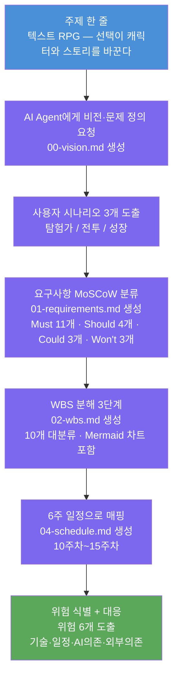

# 05-planning-flow.md — 기획의 흐름

> 세션 2 (11주차) AI Agent와 함께 진행한 기획 흐름 기록

## 흐름도



---

## 단계별 사용 프롬프트

### 1단계 — 비전·문제 정의 요청

```
나는 복잡한 스탯·전투·인벤토리·다중 엔딩을 갖춘 텍스트 RPG 모바일 앱을 만들고 싶다.
다음을 수행해줘.

1) 이 프로젝트의 비전과 목표를 .planning/00-vision.md에 작성
   - 한 줄 가치 제안, 목표, 가치(사용자·개발자·사회), 미래지향성 포함
2) 핵심 사용자 시나리오 3개를 포함할 것
3) 모호한 부분은 나에게 선택형 질문으로 물어본 후 작성

플랫폼은 Flutter로 확정되어 있음.
```

### 2단계 — WBS·일정 생성 요청

```
.planning/00-vision.md 와 .planning/01-requirements.md 를 읽고

1) WBS를 .planning/02-wbs.md에 만들어줘 (3단계 깊이, Mermaid mindmap 포함)
2) 6주(11주차~15주차) 일정을 .planning/04-schedule.md에 작성
   - 각 주차별 목표, 산출물, 검증 방법 명시
   - 13주차에 중간 발표, 15주차가 최종 발표임을 반영
3) 위험 요소 5개 이상과 대응 방안을 함께 작성
```

### 3단계 — 아키텍처·ADR 생성 요청

```
요구사항을 기반으로
1) .planning/03-architecture.md 에 시스템 아키텍처 작성
   - Mermaid 다이어그램 포함 (4레이어: Presentation·State·Domain·Data)
2) 핵심 의사결정은 .planning/decisions/ADR-NNNN-*.md 로 분리
   - ADR-0001: 플랫폼(Flutter)
   - ADR-0002: 상태 관리(Riverpod)
   - ADR-0003: 데이터 저장(Hive)
```

---

## 단계별 산출물 요약

| 단계 | 작업 | 산출물 | 도구 |
|---|---|---|---|
| 1 | 주제 확정 | 텍스트 RPG (Flutter) | 교수 피드백 반영 |
| 2 | 비전·문제 정의 | `00-vision.md` | Claude Code |
| 3 | 사용자 시나리오 | `00-vision.md` 내 시나리오 3개 | Claude Code |
| 4 | MoSCoW 분류 | `01-requirements.md` | Claude Code |
| 5 | WBS 분해 | `02-wbs.md` (Mermaid 차트 포함) | Claude Code |
| 6 | 6주 일정 매핑 | `04-schedule.md` | Claude Code |
| 7 | 위험 식별·대응 | `04-schedule.md` 내 위험 테이블 | Claude Code |

---

## 핵심 원칙

> AI Agent가 생성하되, **본인이 모든 것을 이해하고 설명할 수 있어야** 한다.
