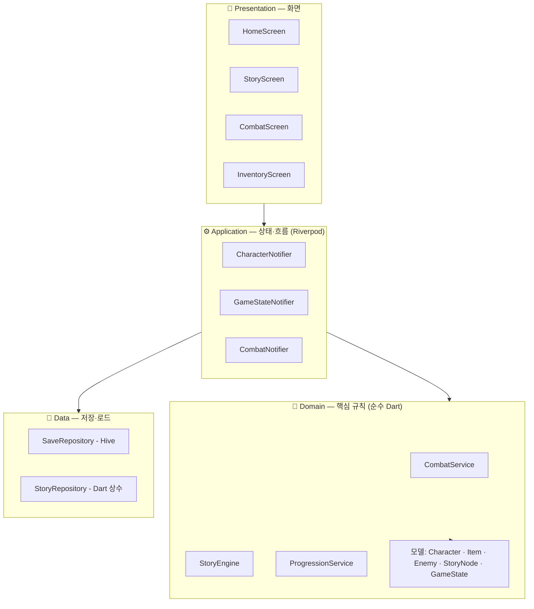

# 아키텍처 설명 — 텍스트 RPG (jangre)

> 이 문서는 "왜 이 파일이 여기 있는가"를 설명합니다.
> `.planning/03-architecture.md` 의 기술 다이어그램을 사람이 읽는 언어로 풀어낸 버전입니다.

---

## 레이어 한눈에 보기



**규칙**: 화면은 Application만 바라본다. Application이 Domain을 호출한다. Domain은 Data를 직접 건드리지 않는다.

---

## 각 레이어가 여기 있는 이유

### `lib/presentation/screens/` — 새 화면은 여기

Flutter 위젯(화면)만 모여 있는 폴더입니다.
비즈니스 로직이 없기 때문에 화면 디자인을 바꿔도 게임 규칙이 망가지지 않습니다.

```
lib/presentation/screens/
├── home_screen.dart          ← 저장 슬롯 선택, 새 게임
├── character_create_screen.dart
├── story_screen.dart         ← 텍스트 출력 + 선택지 버튼
├── combat_screen.dart        ← HP바 + 턴 로그 + 행동 버튼
├── inventory_screen.dart
├── character_screen.dart
└── ending_screen.dart
```

> **한 줄 답변**: "새 화면을 만들면 `presentation/screens/` 에 넣습니다. 로직은 Notifier에 있으니까요."

---

### `lib/presentation/providers/` — 상태·흐름은 여기

Riverpod Notifier가 있는 폴더입니다.
화면 여러 곳에서 같은 상태(캐릭터 HP, 현재 스토리 노드)를 공유해야 하므로 화면 안에 넣지 않고 별도로 관리합니다.

```
lib/presentation/providers/
├── character_provider.dart   ← CharacterNotifier: 스탯·레벨업·XP
├── game_state_provider.dart  ← GameStateNotifier: 현재 노드·플래그·인벤토리
└── combat_provider.dart      ← CombatNotifier: 전투 중 HP·상태이상·턴 로그
```

> **한 줄 답변**: "상태가 바뀌면 `providers/` 의 Notifier를 수정합니다. 화면은 그걸 보고 있으니 자동으로 갱신됩니다."

---

### `lib/domain/` — 핵심 규칙은 여기

Flutter를 import하지 않는 순수 Dart 코드입니다.
게임의 핵심 규칙(데미지 공식, 스토리 분기 조건, 레벨업 계산)이 여기 있습니다.

Flutter 없이도 테스트할 수 있어서, 규칙이 올바른지 빠르게 확인할 수 있습니다.

```
lib/domain/
├── models/
│   ├── character.dart        ← HP·MP·STR·DEF·AGI·LV·XP·클래스
│   ├── item.dart
│   ├── equipment.dart
│   ├── enemy.dart
│   ├── story_node.dart       ← 텍스트·선택지·조건·효과
│   └── game_state.dart       ← 현재 노드·플래그·인벤토리
└── services/
    ├── combat_service.dart   ← 데미지 공식, 상태이상 적용·해제
    ├── story_engine.dart     ← StoryNode 탐색, 조건 평가
    └── progression_service.dart ← XP 누적, 레벨업 임계값
```

> **한 줄 답변**: "전투 공식을 바꾸려면 `domain/services/combat_service.dart` 를 수정합니다. 화면 코드는 건드리지 않아도 됩니다."

---

### `lib/data/` — API·DB는 여기

외부 저장소(Hive)와의 연결을 담당합니다.
Domain은 저장 방식(Hive인지 SQLite인지)을 모릅니다. Data 레이어만 알고 있습니다.

```
lib/data/
├── repositories/
│   ├── save_repository.dart  ← GameState 슬롯 3개 저장·불러오기 (Hive)
│   └── story_repository.dart ← StoryNode 트리 로드 (Dart 상수)
├── adapters/
│   ├── character_adapter.dart   ← Hive TypeAdapter (build_runner 생성)
│   └── game_state_adapter.dart
└── sources/
    └── story_data.dart       ← 챕터 1 스토리 노드 Dart 상수
```

> **한 줄 답변**: "저장 방식을 Hive에서 다른 것으로 바꾸려면 `data/repositories/` 만 교체하면 됩니다. 나머지 레이어는 그대로입니다."

---

## 데이터 흐름 예시 — 선택지를 탭하면

```
1. StoryScreen (Presentation)
   사용자가 선택지 버튼을 탭한다.

2. GameStateNotifier.chooseOption(optionId) (Application)
   Notifier가 StoryEngine을 호출한다.

3. StoryEngine.evaluate(option, gameState) (Domain)
   스탯·아이템·플래그 조건을 검사하고 다음 노드를 결정한다.

4. SaveRepository.save(gameState) (Data)
   바뀐 GameState를 Hive에 기록한다.

5. StoryScreen 리빌드 (Presentation)
   Notifier가 바뀐 상태를 내보내면 화면이 자동으로 새 텍스트를 표시한다.
```

---

## 이 구조를 직접 수정할 때 체크리스트

- [ ] 새 화면 추가 → `presentation/screens/` 에 파일 생성, `app/router.dart` 에 경로 추가
- [ ] 새 게임 규칙 추가 → `domain/services/` 에 로직 작성, Notifier에서 호출
- [ ] 새 저장 항목 추가 → `domain/models/game_state.dart` 필드 추가, `data/adapters/` TypeAdapter 재생성
- [ ] 새 상태 공유 필요 → `presentation/providers/` 에 Notifier 추가 또는 기존 것 확장
